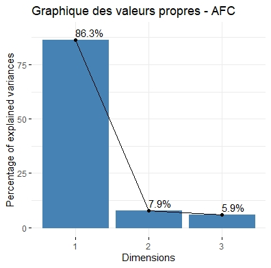
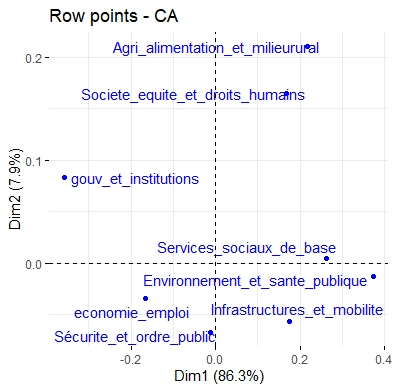
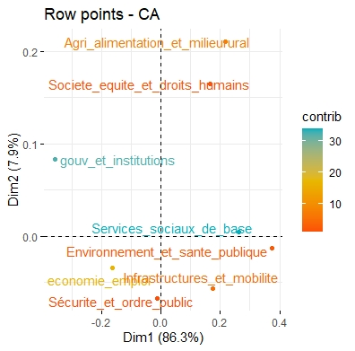
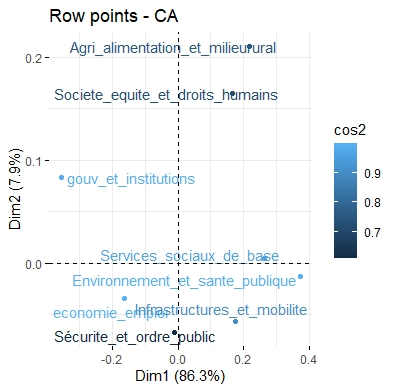
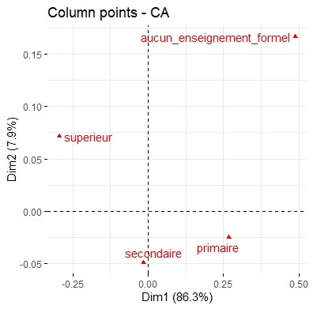
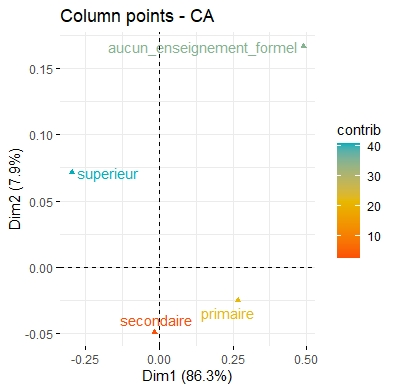
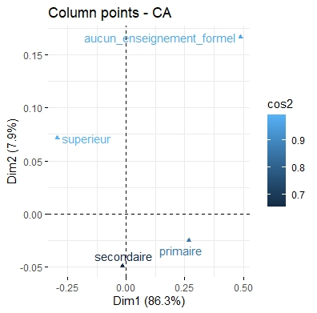
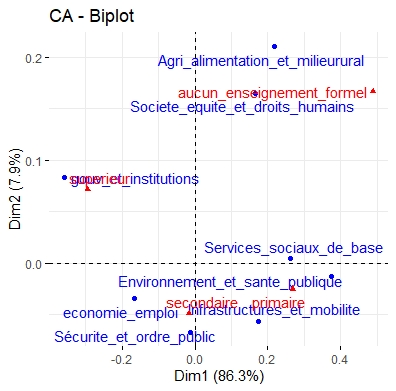

# Annexe technique

## 1. Source des données

- Projet : Afrobarometer Round 10

- Pays : Cameroun

- Période de collecte : 27 février – 20 mars 2024

- Taille échantillon : 1 200 adultes (18 ans+)

- Producteurs : CDD-Ghana, Cible Études & Conseil

- Langues d’administration : français, anglais, pidgin, fufuldé

- Lien vers Afrobarometer https://www.afrobarometer.org

## 2. Liste des abréviations

| Abréviation   | Signification                                                                 |
|---------------|--------------------------------------------------------------------------------|
| **AFC**       | Analyse factorielle des Correspondances                                       |
| **ADD**       | Analyse de Données                                                            |
| **ISE**       | Ingénieur statisticien économiste                                             |
| **ENSAE**     | École nationale de la Statistique et de l’Analyse économique Pierre Ndiaye               |
| **Dim**| Dimension                       |
| **Khi²**      | Statistique du chi-deux                                                       |

---

## 3. Glossaire des indicateurs et notions utiles 

| Terme / Indicateur        | Définition simple                                                                 |
|---------------------------|------------------------------------------------------------------------------------|
| **Modalité**              | Valeur possible d’une variable qualitative (ex : « emploi », « santé »)           |
| **Tableau de contingence**| Tableau croisé entre deux variables qualitatives                                  |
| **Fréquence observée**    | Nombre d’occurrences d’une combinaison de modalités                               |
| **Fréquence théorique**   | Fréquence attendue si les deux variables sont indépendantes                       |
| **Poids (pondération)**   | Coefficient appliqué à une réponse pour représenter correctement la population    |
| **Inertie**               | Mesure de la dispersion globale des données (analogue à la variance)              |
| **Coordonnée**            | Position d’une modalité sur un axe factoriel dans un plan                         |
| **Contribution**          | Part de variance de chaque modalité expliquée par une dimension|
| **Cos² (qualité de représentation)** | La qualité de représentation (Cos2) mesure à quel point une modalité est bien représentée dans l'espace factoriel. Elle est généralement exprimée en pourcentage, et une valeur élevée indique une bonne représentation par les dimensions          |
| **Nuage principal**       | Nuage des modalités actives utilisées pour construire l’AFC                       |
| **Nuage dual**            | Représentation symétrique des modalités de l’autre variable ou des individus      |
| **Indépendance**          | Hypothèse de base testée par l’AFC (absence de lien entre les modalités)          |
| **Chi² global** | test d’indépendance entre attentes et instruction|
| **Valeurs propres (inertie)** | poids des axes factoriels|
---

## 4. Variables utilisées

Pour répondre à notre problématique, trois variables principales ont été sélectionnées à la fois sur leur pertinence analytique et leur adéquation avec une analyse de type AFC (Analyse factorielle des Correspondances), qui exige des variables qualitatives.

### a. Variable filtre – Q98 : Intention de vote

**Question posée** : *« Si des élections présidentielles avaient lieu demain, pour le parti de quel candidat voteriez-vous ? »*

Cette sélection permet de recentrer l’analyse sur ceux qui sont non seulement conscients des enjeux nationaux, mais également disposés à participer au processus électoral.Ont été exclus de l’échantillon :

* Les répondants ayant déclaré qu’ils ne voteraient pas ;
* Ceux ayant refusé de répondre.

### b. Variable clé 1 – Q46PT1 : Doléances principales

**Question posée** : *« À votre avis, quels sont les problèmes les plus importants auxquels le pays fait face et auxquels le gouvernement devrait s’attaquer ? »*

Les réponses ont été traitées à l’aide d’un codage thématique, permettant d’agréger les items similaires en grandes familles de préoccupations, comme le montre le tableau suivant :

```{r doléances-flextable, echo=FALSE, message=FALSE, warning=FALSE, results='asis'}
library(flextable)

doleances_df <- data.frame(
  Catégorie = c(
    "Économie / Emploi",
    "Services sociaux",
    "Gouvernance",
    "Sécurité / Justice",
    "Infrastructures",
    "Environnement"
  ),
  `Exemples de réponses regroupées` = c(
    "Chômage, pauvreté, coût de la vie",
    "Santé, éducation, accès à l’eau, électricité",
    "Corruption, mauvaise gestion, favoritisme, manque de transparence",
    "Insécurité, terrorisme, banditisme, lenteur judiciaire",
    "Routes, transport, urbanisation, accès aux services",
    "Pollution, déforestation, gestion des déchets, climat"
  )
)

flextable(doleances_df) |>
  set_caption("Regroupement thématique des doléances") |>
  autofit()
```

Ce regroupement permet de constituer une variable qualitative synthétique, mieux adaptée à la visualisation dans un plan factoriel. Il évite également la dispersion des modalités rares, qui compliqueraient l’interprétation des axes de l’AFC.

### c. Variable clé 2 – Q96 : Niveau d’instruction

**Question posée** : *« Quel est votre plus haut niveau d’instruction ? »*

Cette variable mesure le capital éducatif des répondants. Pour l’analyse, les modalités ont été regroupées en quatre catégories hiérarchiques, comme le montre le tableau ci-dessous :

```{r niveau-instruction-flextable, echo=FALSE, message=FALSE, warning=FALSE, results='asis'}
library(flextable)

niveau_df <- data.frame(
  `Regroupement` = c("Aucun", "Primaire", "Secondaire", "Supérieur"),
  `Définition` = c(
    "Aucun enseignement formel (analphabétisme, pas d’école)",
    "Enseignement élémentaire partiel ou complet",
    "Premier et second cycles du secondaire",
    "Université, grandes écoles, formations post-bac"
  )
)

flextable(niveau_df) |>
  set_caption("Regroupement des niveaux d’instruction (Q96)") |>
  autofit()
```

## 5. Choix méthodologiques

- Type d’analyse : AFC (Analyse factorielle des Correspondances)

- Pourquoi AFC ? : permet d’étudier les associations entre les modalités de deux variables qualitatives (ici attentes électorales et le niveau d’instruction au Cameroun) et de visualiser les proximités. 

- Prétraitement : Extraction des trois variables d’intérêt issues de la base initiale ; (ii) Exclusion des individus n’exprimant pas d’intention de vote ou refusant de répondre ; (iii) catégorisation des modalités des variables qualitatives.

- Nombre d’axes : (min(n-1, p-1)) = (min(8-1, 4-1))= 3 ; les deux premiers axes expliquent 94,13 % de l’inertie totale. 
Par ailleurs, l’examen des valeurs propres selon la méthode du coude de Cattell confirme ce choix. Ainsi, le plan factoriel retenu est constitué des dimensions 1 et 2.

*Figure 1 : Graphique des valeurs propres*



*Source : Réalisation des auteurs*


## 6. Pondération 

Dans cette analyse, la pondération n’a pas été appliquée.

- Les variables de pondération disponibles dans la base Afrobaromètre (weight_hh ou weight_ea) sont conçues pour refléter la taille totale de l’échantillon, mais ne permettent pas une inférence directe à l’échelle nationale dans le cadre d’une Analyse Factorielle des Correspondances (AFC).

- Par ailleurs, nous ne disposons pas, à ce stade, d’un cadre méthodologique clair permettant d’intégrer rigoureusement ces poids dans l’analyse factorielle.

Nos résultats doivent donc être interprétés comme valables pour l’échantillon enquêté, sans prétention de représentativité nationale.

## 7. Principaux outputs

### a. Nuage des revendications prioritaires suivant les 3 optiques


#### Coordonnées

*Figure 2 : Coordonnées des revendications*


*Source : Réalisation des auteurs*

#### Contributions

 *Figure 3 : Contribution des revendications*



*Source : Réalisation des auteurs*

#### Qualités de représentation

*Figure 4 : Qualité de représentation des revendications*



*Source : Réalisation des auteurs*

### b. Nuage des niveaux d'instruction suivant les 3 optiques

#### Coordonnées

*Figure 5 : Coordonnées des niveaux d'instruction*



*Source : Réalisation des auteurs*

#### Contributions

*Figure 6 : Contribution des niveaux d'instruction*



*Source : Réalisation des auteurs*

#### Qualités de représentation

*Figure 7 : Qualité de représentation des niveaux d'instruction*



*Source : Réalisation des auteurs*


### c. Nuages combinées suivant les 3 optiques

*Figure 8 : Nuages combinées*


*Source : Réalisation des auteurs*


